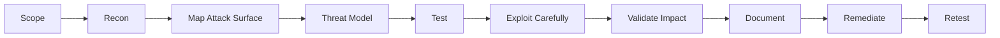

<!--
  Modern Pentesting / Cybersecurity GitHub Profile README
  Replace:
  - maajix with your GitHub username
  - max-randhahn / maajix.github.io / maajix.github.io if desired
-->

<div align="center">

#  `root@github:~# whoami`


<br>


</div>

---

<div align="center">

```txt
┌──(max㉿github)-[~/profile]
└─$ ./init_operator.sh

[+] Loading offensive security profile...
[+] Web security modules initialized
[+] Recon mindset enabled
[+] Report-writing discipline loaded
[+] Legal authorization required: TRUE
```

</div>

---

## `./about`

I am a **Penetration Tester** focused on practical, real-world security testing with a strong emphasis on **web applications**, **APIs**, and **authentication / authorization flaws**.

I like turning complex attack surfaces into clear findings, reproducible proof-of-concepts, and actionable remediation guidance.

```yaml
operator:
  name: Max
  role: Penetration Tester
  location: Germany
  focus:
    - Web Application Security
    - API Security
    - Authentication & Authorization
    - Vulnerability Validation
    - Secure Code Review
    - Offensive Automation
  mindset: "enumerate -> understand -> exploit -> document -> harden"
  rule_zero: "Only test systems with explicit authorization."
```

---

## `./current_focus`

```bash
cat focus.txt
```

```txt
> Deepening methodology for modern web app pentests
> Building small tools that automate boring recon
> Improving finding quality, exploit clarity, and remediation value
> Practicing CTFs and real-world attack chain thinking
> Researching auth, business logic, and API abuse patterns
```

---

## `./arsenal`

<div align="center">

### Languages & Scripting


### Security Toolkit


</div>

---

## `./specializations`

```txt
drwxr-xr-x  web-application-security
drwxr-xr-x  api-security-testing
drwxr-xr-x  auth-and-access-control
drwxr-xr-x  recon-and-enumeration
drwxr-xr-x  secure-code-review
drwxr-xr-x  vulnerability-validation
drwxr-xr-x  exploitation-methodology
drwxr-xr-x  reporting-and-remediation
```

### Things I enjoy breaking, responsibly

- Authentication flows
- Session management
- Authorization boundaries
- APIs and hidden endpoints
- Input validation layers
- Business logic assumptions
- Security headers and browser-side controls
- File upload and parser logic
- Access control models
- Misconfigured cloud or containerized environments

---

## `./methodology`



```bash
while read target; do
  enumerate "$target"
  map_attack_surface "$target"
  test_controls "$target"
  validate_impact "$target"
  write_clear_report "$target"
done < authorized_scope.txt
```

---

## `./featured_projects`

> Pin your best repositories here. Keep it clean, focused, and useful.

<table>
<tr>
<td width="50%">

### 🛰️ Recon Automation
Small scripts and workflows for repeatable enumeration.

`python` `bash` `httpx` `nuclei` `amass`

</td>
<td width="50%">

### 🧪 Web Security Labs
Payload notes, vulnerable labs, and writeups.

`owasp` `burp` `websec` `ctf`

</td>
</tr>
<tr>
<td width="50%">

### 🔐 Auth Testing Notes
Checklists for login, session, JWT, OAuth, and access control testing.

`auth` `oauth` `jwt` `idor`

</td>
<td width="50%">

### 🧰 Pentest Utilities
Tiny tools that remove friction during assessments.

`cli` `automation` `security`

</td>
</tr>
</table>

---

## `./github_stats`

<div align="center">


<br>


</div>

---

## `./terminal`

```bash
┌──(max㉿github)-[~/notes]
└─$ grep -r "security" mindset.md
```

```txt
security is not a checkbox
security is not a single scan
security is a process of understanding assumptions
security improves when findings become fixes
```

---

## `./connect`

<div align="center">

<a href="https://github.com/maajix">
  
</a>
<a href="https://linkedin.com/in/max-randhahn">
  
</a>
<a href="https://maajix.github.io">
  
</a>
<a href="https://maajix.github.io">
  
</a>

</div>

---

<div align="center">

```txt
┌──(max㉿github)-[~]
└─$ echo "Hack responsibly. Report clearly. Fix thoroughly."
```


</div>
